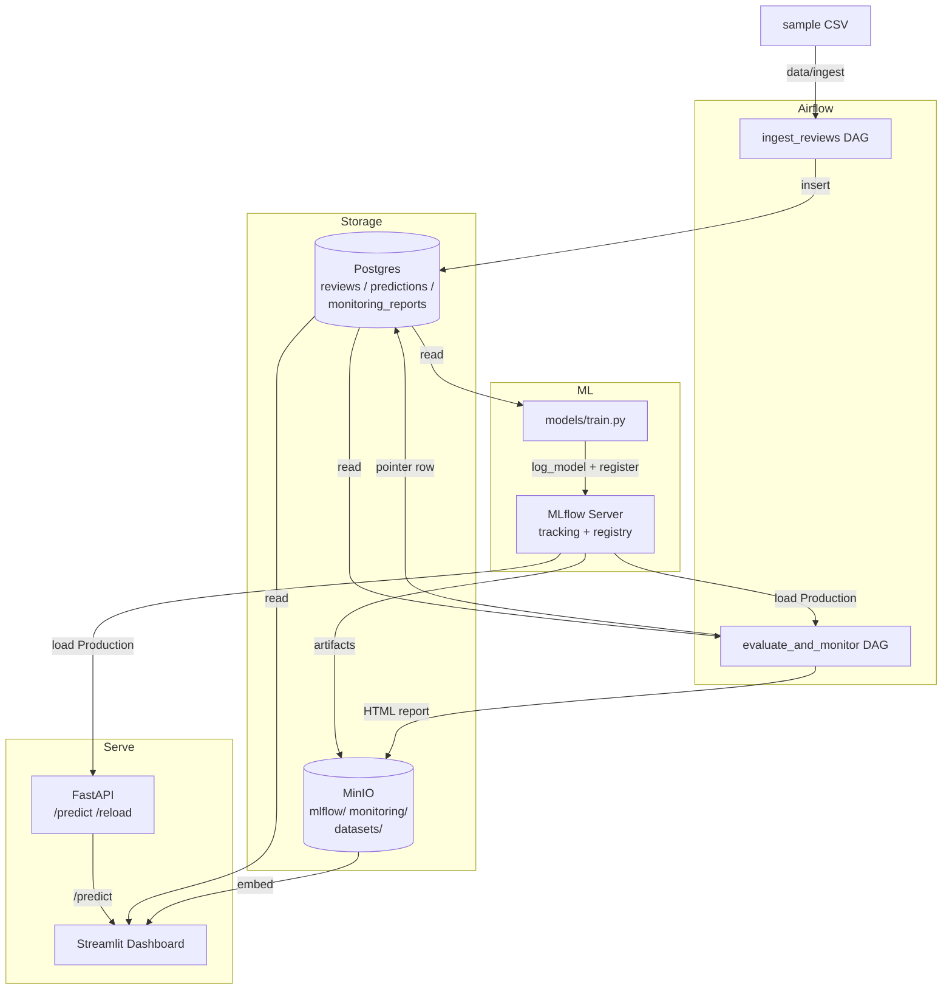
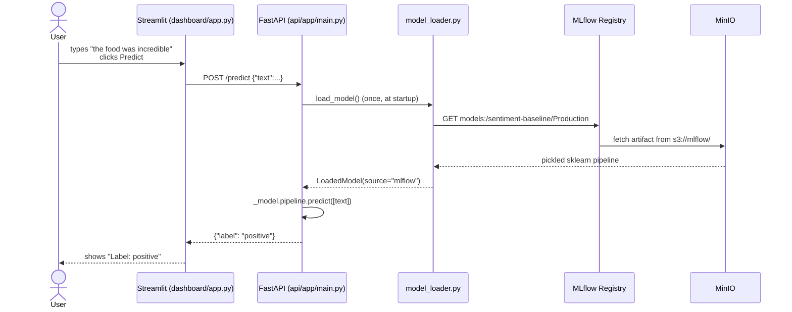
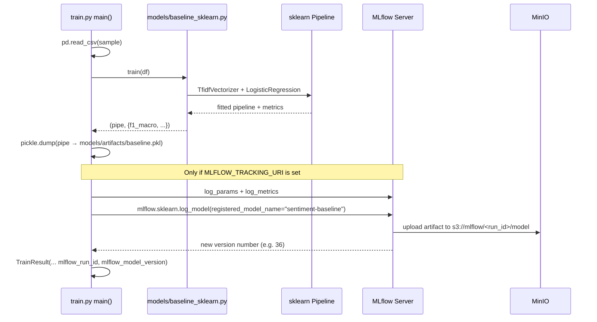

# Code Walkthrough

A reading guide for the codebase. Pair this with [ARCHITECTURE.md](./ARCHITECTURE.md)
(what the system is) and [WORKFLOW.md](./WORKFLOW.md) (who owns what).
This file explains **how the code is laid out and how the pieces talk to each other.**

---

## 1. If you only read 5 files

Read these in order. Together they explain ~80% of the codebase.

| # | File | What it teaches |
|---|------|-----------------|
| 1 | [`data/sample/reviews_sample.csv`](./data/sample/reviews_sample.csv) | The shape of the data everything else operates on |
| 2 | [`models/baseline_sklearn.py`](./models/baseline_sklearn.py) | The model: TF-IDF + LogisticRegression |
| 3 | [`models/train.py`](./models/train.py) | Training: fit → save pickle → log to MLflow → register |
| 4 | [`api/app/main.py`](./api/app/main.py) | Serving: `/health`, `/predict`, `/predict/batch`, `/reload` |
| 5 | [`dashboard/app.py`](./dashboard/app.py) | UI: 5 sections built on top of `dashboard/data.py` |

After those, look at `data/ingest/ingest_reviews.py`, `data/expectations/reviews_suite.py`,
and `monitoring/drift_checks.py` to see ingestion, validation, and drift respectively.

---

## 2. The big picture



---

## 3. Folder tour

One sentence per folder.

```
mle_project/
├── data/
│   ├── sample/             # The 999-row CSV everything trains on (kept in git).
│   ├── ingest/             # ingest_reviews.py: CSV → soft-clean → GE gate → Postgres.
│   └── expectations/       # reviews_suite.py: the Great Expectations rules.
│
├── models/
│   ├── baseline_sklearn.py # TF-IDF + LogisticRegression. Phase 1 model.
│   ├── train.py            # Entry point: train, save pickle, log to MLflow.
│   └── distilbert_finetune.py  # Phase 2 model. HuggingFace Trainer.
│
├── api/
│   ├── app/
│   │   ├── main.py         # FastAPI routes.
│   │   ├── schemas.py      # Pydantic request/response (the API contract).
│   │   └── model_loader.py # MLflow Registry first, pickle fallback.
│   └── requirements.txt
│
├── dashboard/
│   ├── app.py              # Streamlit script (just rendering).
│   ├── data.py             # Pure data helpers (testable without Streamlit).
│   └── requirements.txt
│
├── airflow/dags/
│   ├── ingest_reviews.py   # Thin DAG wrapper around data/ingest/.
│   └── evaluate_and_monitor.py  # Drift gate DAG.
│
├── monitoring/
│   └── drift_checks.py     # Evidently + F1-drop + MinIO upload + DB row.
│
├── infra/
│   ├── docker/             # Per-service Dockerfiles.
│   └── .env.example        # Canonical list of env vars.
│
├── tests/
│   ├── conftest.py         # Adds project root to sys.path, slow-test gate.
│   ├── test_*.py           # Unit tests (no services, fast).
│   └── integration/        # Tests against a live compose stack.
│
├── scripts/
│   ├── build_sample.py     # Re-generate data/sample/reviews_sample.csv.
│   └── up.sh               # docker compose helper.
│
├── .github/workflows/ci.yml  # 4 jobs: lint, unit-tests, smoke-docker, compose-integration.
├── docker-compose.yml        # The full local stack.
├── pyproject.toml            # ruff config + pytest markers.
├── ARCHITECTURE.md           # What the system is.
├── WORKFLOW.md               # Who owns what.
├── CODE_WALKTHROUGH.md       # ← you are here.
└── README.md
```

---

## 4. The three flows

### Flow A — A prediction

What happens when you type a review into the dashboard and click **Predict**.



**Key insight:** the model is loaded **once** at API startup. Subsequent
predictions just call `.predict()` on the in-memory pipeline. To swap to
a newer version without restarting, call `POST /reload`.

---

### Flow B — A training run

What happens when you run `python models/train.py`.



**Key insight:** the pickle on disk is a **fallback**; the source of truth
is the model in MLflow's registry. The version lands at stage `None` —
promotion to `Production` is a separate step (manual via UI, or
programmatic via `MlflowClient.transition_model_version_stage`).

---

### Flow C — Ingestion + validation

What happens when the `ingest_reviews` DAG runs (or `python -m data.ingest.ingest_reviews`).

```mermaid
sequenceDiagram
  participant DAG as ingest_reviews.py
  participant Ingest as data/ingest/ingest_reviews.py
  participant Clean as load_and_validate()
  participant GE as data/expectations/reviews_suite.py
  participant PG as Postgres

  DAG->>Ingest: ingest(csv_path, dsn)
  Ingest->>Clean: load_and_validate(csv_path)
  Clean->>Clean: drop nulls, drop short text,<br>drop pure-emoji, drop bad labels
  Clean-->>Ingest: clean DataFrame

  Ingest->>GE: validate_reviews(df)
  GE->>GE: schema, length, regex, labels,<br>rating range, language distribution
  alt all expectations pass
    GE-->>Ingest: ValidationResult(success=True)
    Ingest->>PG: TRUNCATE reviews; INSERT ...
    Ingest-->>DAG: row count
  else any expectation fails
    GE-->>Ingest: ValidationResult(success=False)
    Ingest->>Ingest: raise ValueError
    Note over PG: Postgres unchanged — no partial write
  end
```

**Key insight:** two stages. `load_and_validate` is **soft cleaning**
(drop rows that look obviously bad). The GE suite is the **hard gate**
(if the cleaned batch still violates an invariant, fail the whole DAG
before touching Postgres).

---

## 5. Module-by-module reference

### `models/baseline_sklearn.py`

The model. Two pure functions:

| Function | What it does |
|----------|--------------|
| `build_pipeline()` | Returns an unfit `sklearn.Pipeline([tfidf, logreg])` |
| `train(df)` | Splits, fits, evaluates → `(fitted_pipe, metrics_dict)` |

The 5 `# TODO (member)` blocks mark where the modeling team can improve
preprocessing, vectorizer config, classifier choice, split strategy, and
metrics — without breaking anything downstream.

### `models/train.py`

The entry point. Wraps `baseline_sklearn.train()` with side effects:
- writes a pickle to `models/artifacts/baseline.pkl`
- if `MLFLOW_TRACKING_URI` is set: logs the run + registers the model
- returns a `TrainResult` dataclass (artifact path, metrics, MLflow ids)

Run from the CLI: `python models/train.py`.

### `data/ingest/ingest_reviews.py`

Two pure helpers + one orchestrator + a CLI:

| Function | What it does |
|----------|--------------|
| `load_and_validate(csv_path)` | Read CSV, drop bad rows, return clean DataFrame |
| `to_records(df)` | DataFrame → list of tuples for `executemany` |
| `insert_records(records, dsn)` | TRUNCATE + INSERT into `reviews` |
| `ingest(csv_path, dsn)` | end-to-end with GE gate in the middle |

The DAG file `airflow/dags/ingest_reviews.py` is a one-line Airflow wrapper
around `ingest()` — all real logic stays here.

### `data/expectations/reviews_suite.py`

The validation gate. One important function:

```python
validate_reviews(df) -> ValidationResult
```

Runs ~10 Great Expectations checks (schema, nulls, label whitelist,
rating range, text length, regex, label cardinality) plus a custom
language-distribution check (langdetect-based, sampled for speed).

Returns a `ValidationResult` with `.success` and `.failures`. Call
`.raise_for_status()` to convert failure into an exception.

### `api/app/main.py`

The FastAPI service. 4 routes:

| Route | Body | Returns |
|-------|------|---------|
| `GET /health` | — | `{status, model_loaded, model_source}` |
| `POST /predict` | `{text}` | `{label}` |
| `POST /predict/batch` | `{texts: [...]}` (max 256) | `{labels: [...]}` |
| `POST /reload` | header `X-Admin-Token` | `{status, ...}` |

The module-level `_model` variable holds the loaded model. `/reload`
mutates it (atomic in CPython, fine for single-worker uvicorn).

### `api/app/model_loader.py`

`load_model() -> LoadedModel | None`. Resolution order:

1. If `MLFLOW_TRACKING_URI` and `MODEL_NAME` are set → fetch
   `models:/<name>/<stage>` from the registry. **Raises** on failure
   (because silent fallback to a stale pickle in prod would be bad).
2. Else if `MODEL_PICKLE_PATH` exists → load that pickle.
3. Else → `None` (API still boots, but `/predict` returns 503).

### `dashboard/data.py`

Pure data-layer helpers — no Streamlit imports, easy to unit-test:

| Function | Source |
|----------|--------|
| `load_reviews(dsn)` | Postgres first, CSV fallback |
| `sentiment_timeline(df, freq)` | % positive per day/week |
| `negative_word_counts(df, top_n)` | Token frequencies in `label=='negative'` |
| `list_mlflow_runs()` | Recent runs from MLflow |
| `latest_drift_report(dsn)` | Most recent `monitoring_reports` row |
| `fetch_drift_html(s3_url, client)` | Download the embedded HTML |

### `dashboard/app.py`

The Streamlit script. Five sections, each is a `render_*` function:
tiles, timeline, word cloud, MLflow A/B, drift report. Each section
calls one function from `dashboard.data` and renders the result.

### `monitoring/drift_checks.py`

Evidently + the F1-drop gate.

```python
evaluate(reference_df, current_df, conn, minio, model=None, raise_on_block=False)
```

1. `compute_drift(ref, cur)` — runs Evidently, returns drift score + HTML
2. If `model` given: `compute_model_f1` on both sides → `f1_drop`
3. Uploads HTML to `s3://monitoring/<date>/<type>.html`
4. Inserts pointer row into `monitoring_reports`
5. If blocked AND `raise_on_block=True` → raises `PromotionBlocked`

The order matters: upload **before** raise, so the failing report stays
visible in the dashboard.

---

## 6. How the tests are organized

```mermaid
flowchart LR
  subgraph Unit / Smoke - fast, no services
    A[tests/test_smoke.py]
    B[tests/test_ingest_unit.py]
    C[tests/test_ge_suite.py]
    D[tests/test_drift_unit.py]
    E[tests/test_drift_gate_unit.py]
    F[tests/test_train_mlflow_unit.py]
    G[tests/test_api_batch_reload.py]
    H[tests/test_dashboard_data.py]
    I[tests/test_dashboard_app.py]
    J[tests/test_distilbert_unit.py]
    K[tests/test_ci_workflow.py]
  end

  subgraph Integration - needs Docker compose
    L[tests/integration/test_infra.py]
    M[tests/integration/test_ingest.py]
    N[tests/integration/test_ge_gate.py]
    O[tests/integration/test_train_mlflow.py]
    P[tests/integration/test_api_mlflow.py]
    Q[tests/integration/test_drift_pipeline.py]
    R[tests/integration/test_drift_gate.py]
    S[tests/integration/test_api_reload_mlflow.py]
    T[tests/integration/test_e2e_pipeline.py]
  end

  subgraph Opt-in slow
    U[tests/test_distilbert_slow.py]
  end
```

Run modes:

| Command | Runs |
|---------|------|
| `pytest tests/ --ignore=tests/integration` | Unit/smoke only (CI default, ~15s) |
| `pytest tests/integration/` | Integration only (needs `./scripts/up.sh`) |
| `RUN_SLOW=1 pytest tests/test_distilbert_slow.py` | Real DistilBERT training (~30s after cache) |
| `pytest tests/` | Everything except slow tests |

---

## 7. Where state lives

| State | Where | When is it cleared |
|-------|-------|---------------------|
| Raw reviews | `data/sample/reviews_sample.csv` | Never (in git) |
| Ingested reviews | Postgres `sentiment.reviews` | Every ingest run (TRUNCATE) |
| Predictions log | Postgres `sentiment.predictions` | Phase 2 wiring (not in Phase 1) |
| Drift report HTML | MinIO `monitoring/<date>/...` | Manual cleanup |
| Drift report pointers | Postgres `sentiment.monitoring_reports` | Append-only |
| Trained model artifacts | MinIO `mlflow/<run_id>/model/` | MLflow handles retention |
| Trained model versions | MLflow registry | Never (append-only with stages) |
| Local pickle fallback | `models/artifacts/baseline.pkl` | Overwritten each `train.py` run |
| Airflow metadata | Postgres `airflow` DB | Survives container restarts |

---

## 8. Reading order for new contributors

If you're trying to make a change, here's where to start:

| You want to... | Read this first |
|----------------|-----------------|
| Tune the model | `models/baseline_sklearn.py` (look for `# TODO (member)`) |
| Add a new validation rule | `data/expectations/reviews_suite.py` |
| Change the API contract | `api/app/schemas.py` (then update `dashboard/app.py`) |
| Add a dashboard widget | `dashboard/data.py` (helper) + `dashboard/app.py` (render) |
| Make ingestion incremental | `data/ingest/ingest_reviews.py` (`insert_records` currently TRUNCATEs) |
| Migrate off deprecated MLflow stages | `api/app/model_loader.py` (TODO at top of `_try_mlflow`) |
| Add Phase 2 transformer | `models/distilbert_finetune.py` (already scaffolded) |

If you're trying to debug a failing test, the integration tests are
named after the feature they cover — start with the integration test
whose name matches the layer that broke.
